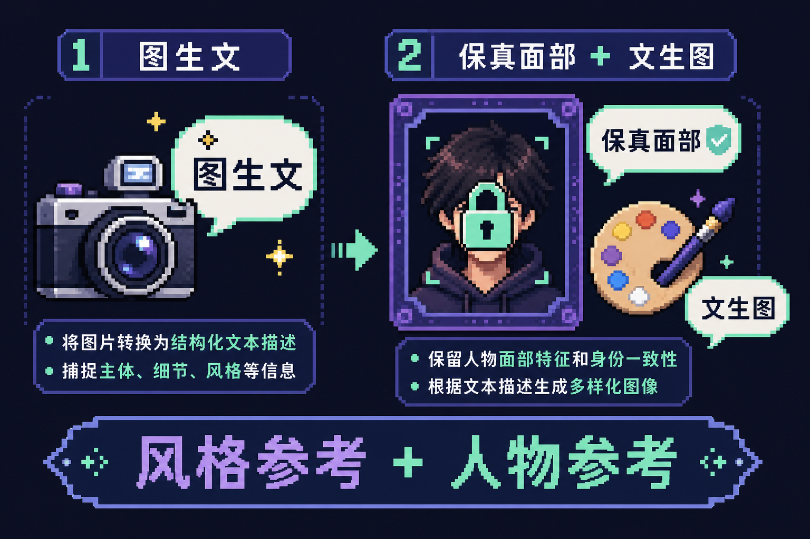

<div align="center">

# 🎨 Picture Painter

### CHROMA STUDIO · 图生文 · 文生图

**参考图分析风格 → 按描述生成新图，并锁定人物面部**

<br/>


<br/>

[](https://www.python.org/)
[](https://fastapi.tiangolo.com/)
[](https://vuejs.org/)

</div>

---

## 解决什么问题

修图或 AI 出图时，常见需求是：

| | 含义 |
|---|------|
| **图 A** | 想要的光影、构图、色彩、氛围 |
| **图 B** | 必须保留身份的人物照 |

手写提示词很难同时表达「**风格像 A、脸必须是 B**」。本项目用两步流水线自动完成：

<div align="center">



*图 1：风格参考 → 图生文 → 文生图（面部保真）*

</div>

1. **图生文** — 从风格参考图生成专业修图/场景描述（不针对换脸）
2. **文生图** — 将描述与人物参考图交给图像 API，在保真面部的前提下生成新图

---

## 功能概览

| 步骤 | 能力 | 可选后端 |
|:----:|------|----------|
| ① 图生文 | 上传参考图 + 身份提示 | 本地 Qwen VL · OpenAI 兼容多模态 API |
| ② 文生图 | 描述 + 人物参考图 | 火山方舟豆包 Seedream · MiniMax 图像 API |

---

## 环境要求

- **Python** 3.10+
- **本地图生文**：视觉模型置于 `checkpoint/xy_model`（见目录内说明），建议 NVIDIA GPU + CUDA
- **文生图**：配置对应平台 API Key（环境变量，勿提交 Git）

> `checkpoint/` 与 `config.local.yaml` 已写入 `.gitignore`，克隆后需自行准备模型与本地配置。

---

## 快速开始

```bash
# 1. 安装依赖
pip install -r requirements.txt

# 2. 本地配置（勿把密钥提交仓库）
copy config.yaml config.local.yaml
# 指定配置路径：
# set PICTURE_PAINTER_CONFIG=D:\path\config.local.yaml

# 3. API Key（名称以 config 中 api_key_env 为准）
set ARK_API_KEY=your_ark_key
set MINIMAX_API_KEY=your_minimax_key
set OPENAI_API_KEY=your_openai_key

# 4. 启动 → 默认 http://127.0.0.1:8000 ，自动打开浏览器
python server.py
```

**界面操作**：上传风格参考图 → 生成描述 → 上传人物参考图 → 生成图片

---

## 配置说明

主配置 `config.yaml`，常用项：

| 配置项 | 说明 |
|--------|------|
| `vision_caption.backend` | `local` \| `openai_compatible` |
| `image_generation.backend` | `doubao_ark` \| `minimax_api` \| `none` |
| `server.host` / `server.port` | 服务地址 |
| `model_catalog` | 前端可选模型列表 |
| `paths.checkpoint_relative` | 本地模型路径（默认 `checkpoint/xy_model`） |

---

## 项目结构

```
picture_painter/
├── docs/assets/        # README 配图
├── server.py           # FastAPI 入口
├── index.html          # Vue 前端
├── caption_backend.py  # 图生文
├── doubao_ark_image.py # 豆包文生图
├── minimax_image.py    # MiniMax 文生图
├── config.yaml         # 默认配置模板
└── checkpoint/         # 本地视觉模型（git 忽略）
```

---

## 许可与模型

本地视觉模型权重遵循 `checkpoint/xy_model/LICENSE` 等目录内许可。商用或再分发前请自行确认模型与第三方 API 使用条款。
